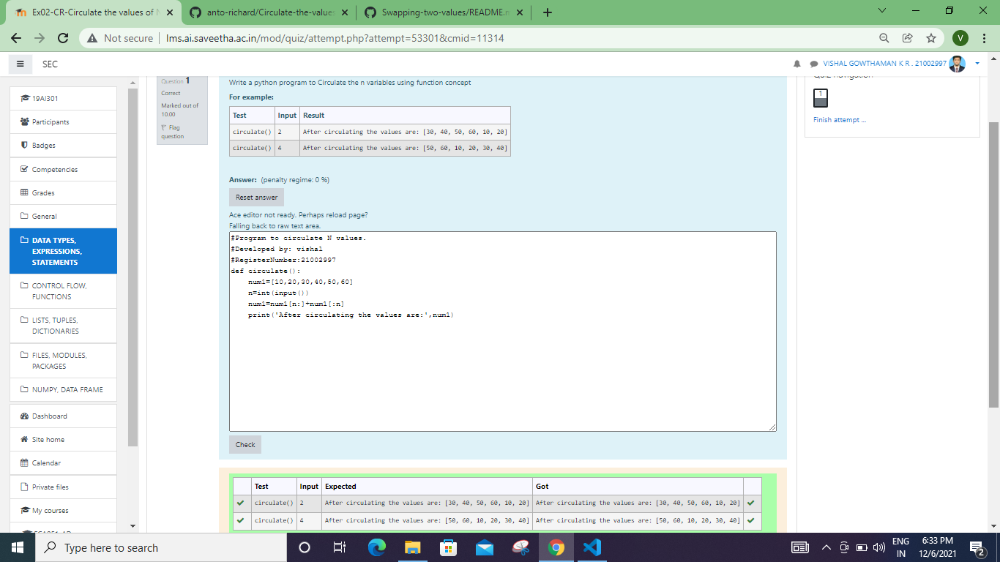

# DISTANCE-BETWEEN-TWO-POINTS

## AIM:
To write a python program to find the distance two 2 points
## ALGORITHM:
### Step 1: Import numpy module as np to use the built-in function for calcluating the distance between the two points
### Step 2: Get the x1 and x2 values from the user to calculate the distance between the two points
### Step 3: Substitute the values in the distance formula
Substitute the values in the distance formula  
### Step 4: Print the distance between the two points in two decimal places by {:.2f} format
### Step 5: End the program
### PROGRAM:
import numpy as np
l1=[4,2]
l2=[10,6]
dist=np.sqrt(((l2[0]-l1[0])**2)+((l2[1]-l1[1])**2))
print("{:.2f}".format(dist))
  

### OUTPUT:

### RESULT:
